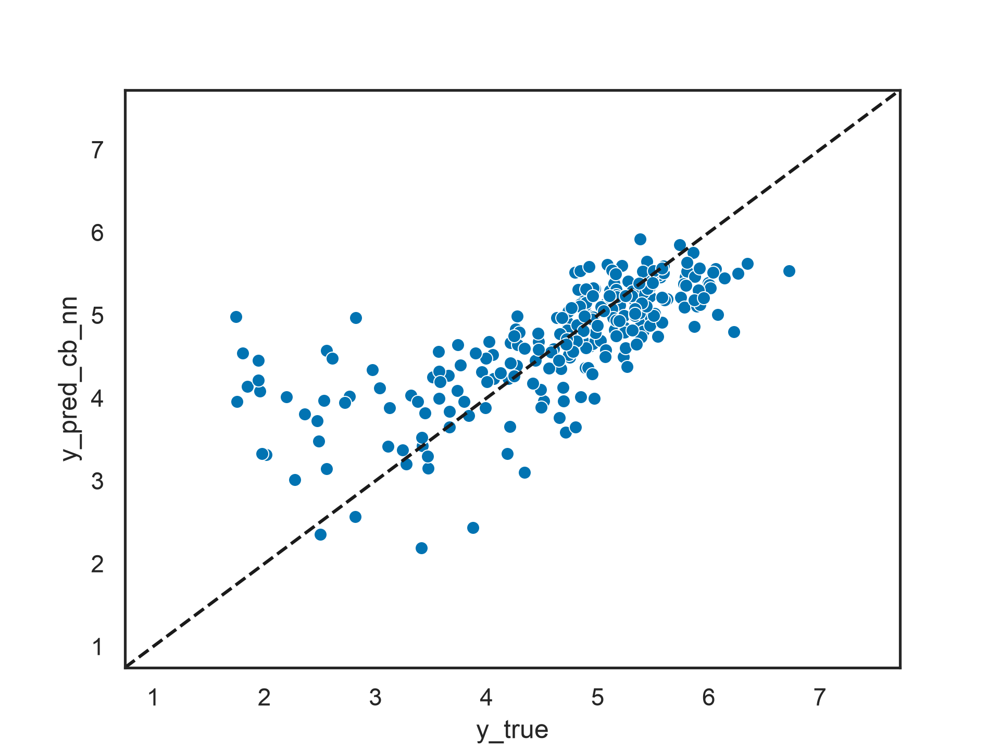

# OpenADMET PXR Challenge - Model Report
# Overview
The Pregnane-X Receptor (PXR) is a nuclear receptor that regulates the expression of drug metabolizing enzymes. Activation of PXR by small molecule ligands can increase enzyme levels, potentially leading to adverse drug-drug interactions and toxicity, making it an important antitarget in drug discovery and a major determinant of the adsorption, distribution, metabolism, excretion, and toxicity (ADMET) profile of new drug candidates. The OpenADMET organization has opened a challenge focused on the prediction of PXR activation by small molecules. The challenge participants are tasked with training quantitative structure-activity relationship (QSAR) models to predict the pEC50 values of a blind test set containing 513 PXR ligands. The preliminary results placed me among the top 50 participants, with models achieving coefficient of determination (R2) values between 0.5 and 0.6.
# Data preparation
The training set combined three datasets provided by OpenADMET:
-   Original training dataset (n = 4139)
-   Crudes dataset (n = 347)
-   Semipure dataset (n = 90)

The original training dataset was released at the start of the challenge, while the Crudes and Semipure datasets became available later. The test set consisted of 513 compounds, of which 253 had publicly available (unblinded) pEC50 values and 260 remained blinded. All datasets were standardized using RDKit. The preprocessing workflow consisted in:
-   Removing salts while retaining the largest fragment.
-   Neutralizing molecules.
-   Generating canonical SMILES and InChIKeys.
-   Aggregating duplicate compounds by averaging their pEC50 values.

Only one duplicate compound was identified in the original training dataset. Three compounds were removed from the training data:
- two because they fell outside the permitted heavy atom range (4 - 75).
- one because it contained a non-standard element.

After concatenation, the final training set contained **4570 compounds**. The same preprocessing pipeline was applied to the test set, and no compounds were removed. Finally, the training data were split into five folds for cross-validation using the Tanimoto similarity splitter implemented in DeepChem.
# Molecular descriptors
Compounds were represented using a combination of 2D and 3D molecular descriptors:
1.  **Morgan fingerprints** (radius = 2, 2048 bits)
2.  **VolSurf descriptors** (122 features)

The compounds' canonical SMILES were processed with MoKa to generate the most abundant tautomeric and protomeric form at pH 7.4 in water medium. These normalised SMILES were used as input for calculating the descriptors. The continuous VolSurf descriptors were standardized using the training set statistics (mean removal and unit variance scaling), and the same transformation was applied to the test set. The scaled VolSurf descriptors were then concatenated with the Morgan fingerprints to form the final feature matrix used for model training.
# Model definition
The model was a consensus of two different regression models trained using the same descriptors but different algorithms.
## CatBoost
I configured a CatBoost regressor for predicting continuous biochemical properties. It builds an ensemble of up to 3000 decision trees, sequentially fitting each tree to correct the errors of the previous ones. A relatively low learning rate (0.03) and moderate tree depth (6) allow the model to capture complex, non-linear relationships while reducing the risk of overfitting. Additional regularization parameters, including L2 leaf regularization, feature subsampling (rsm = 0.5), and stochastic sampling (bagging_temperature = 1), further improve generalization. Training is made more efficient through early stopping, which halts the boosting process if performance on the validation set does not improve for 50 consecutive iterations (early_stopping_rounds = 50).
## Neural Network
This models was a multimodal feed-forward neural network implemented with PyTorch. Separate neural network branches first learn latent representations from each input, reducing the Morgan fingerprints to a 256-dimensional embedding and the VolSurf descriptors to a 64-dimensional embedding. These embeddings are then concatenated and passed through a shared prediction head to produce a single continuous output for regression tasks. The architecture incorporates ReLU activations, batch normalization, and dropout layers to improve training stability, reduce overfitting, and enhance generalization.

I generated the consensus predictions with the following formula: YConsensus = YCatBoost * 0.5 + YNeurlaNetwork * 0.5
# Training & evaluation
For each model, I performed cross-validation with early stopping and 3000 iterations to block the trainig at the most optimal point. When aggregating the 5 folds to calculate the performance scores, I also averaged the number of iterations for the intermediate and final model training. The following table reports the cross-validation scores, mean absolute error (MAE) and R2.

| Model | MAE (mean) | MAE (std) | R2 (mean) | R2 (std) |
|----------|----------|----------|----------|----------|
| CatBoost | 0.5342 | 0.0261 | 0.5563 | 0.0661 |
| Neural netwrork | 0.5564 | 0.02 | n.d. | n.d. |

I trained an intermediate CatBoost with the full training set (n = 4570) and by setting the number of iterations to 1171 (the mean iterations across the 5 cross-validation folds). I used this model to predict the 253 unblinded test set compounds. The following table reports the prediction scores and the relative absolute error (RAE) which is used for ranking the challenge participants.

| Model | MAE | RAE | R2 |
|----------|----------|----------|----------|
| CatBoost | 0.5064 | 0.6341 | 0.4905 |
| Neural netwrork | 0.5195 | 0.6505 | 0.4975 |
| Consensus | **0.4853** | **0.6077** | **0.5170** |

Finally, I concatenated the training set with the unblinded test set (for a total of 4823 compounds), I applied the same scaling to the VolSurf descriptors of the training and the blind test sets, trained a final model and predicted the blind test compounds. These predictions, and the ones generated for the unblinded test set using the intermediate model, were submitted to OpenADMET for the final ranking.

# Results analysis
<figure>
  
  <figcaption>Figure 1. Scatter plot of the experimental (y_true) and predicted (y_pred_cb_nn) pEC50 for the unblinded test set.</figcaption>
</figure>

The scores relative to the prediction of the 253 unblinded compounds are indicative of a model with decent predictive power. The experimental vs predicted scatter plot in Figure 1 shows that the model struggles more in predicting the high and low pEC50 values at the extremes of the activity distribution. The overprediction of the inactives and the underprediction of the actives can be quantified by calculating the bias (error) for each activity bin.

| pEC50 bin | Compounds count | Bias | MAE |
|----------|----------|----------|----------|
| (1.5, 3] | 24 | 1.5731 | 1.6064 |
| (3, 4] | 31 | 0.2737 | 0.4934 |
| (4, 5] | 86 | -0.0194 | 0.3436 |
| (5, 6] | 102 | -0.2283 | 0.3052 |
| (6, 8] | 10 | -0.8187 | 0.8187 |

The model's limited predictive performance for highly active compounds may be attributed to the lack of an appropriate 3D conformer representation, which can play a critical role in protein binding. Conversely, the model's difficulty in predicting compounds with low activity may not be entirely due to the model itself. Instead, it is likely influenced by the high experimental uncertainty associated with low-activity compounds, which reduces confidence in their reported activity labels. As the challenge organisers noted, "I wouldn't put much faith in anything less than 4 (100 μM), which is probably close to the solubility limit for most compounds." (https://discord.com/channels/1412827471488745545/1481446049473237187/1498865953386266865).

# Conclusion
For the second stage of the OpenADMET - PXR challenge (activity prediction track) I have developed a regression model and predicted the pEC50 of a partially blind dataset of PXR ligands with it. The model showed good predictive power, but struggled to predict accurately the values at the extremes. Future work will include the use of conformer-dependent 3D descriptors to identify the active conformations of the high end potency compounds, structure-based representations to improve the overall accuracy,  multi-instance learning to account for multiple chemical states of compounds, and the incorporation of the experimental uncertainty to downweight the low activity compounds.
# Acknowledgments
- OpenADMET for organising the challenge.
- [Molecular Discovery Ltd](https://www.moldiscovery.com/) for providing the programs MoKa and VolSurf.
